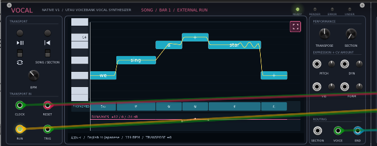
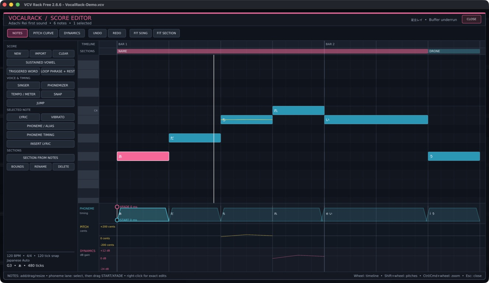

# Cosmic Matter: Vocal

[](https://github.com/CosmicScribe64/CosmicMatter-Vocal/actions/workflows/ci.yml)

Vocal brings Vocaloid/UTAU-style singing synthesis into VCV Rack 2. Write or import an English or Japanese vocal score, synchronize it to a modular clock, shape the performance with CV, and patch the voice through ordinary Rack modules.

The plugin is free and works without a DAW or OpenUtau installation. It includes the official Adachi Rei 3.5.0 UTAU voicebank for an offline first sound.

## Interface

<p align="center">
  
</p>
<p align="center"><sub>The 64 HP Vocal module turns a written score into a clockable, patchable Rack voice.</sub></p>

<p align="center">
  
</p>
<p align="center"><sub>The full score editor keeps notes, lyrics, phonemes, pitch, dynamics, and sections in one view.</sub></p>

## Modules

| Module | Purpose |
|---|---|
| **Vocal** | A 64 HP monophonic vocal workstation with a piano-roll editor, UTAU voicebank rendering, transport, sections, expression CV, and mono audio output. |
| **Singer Plate** | A visual companion that displays a voicebank's portrait and singer name. It has no ports or DSP. |

The permanent Rack plugin slug is `CosmicMatter-Vocal`. Its lossless project extension remains `.vocalrack` so projects have an explicit, portable format.

## Highlights

- Rack-native piano-roll editing for notes, lyrics, pronunciation, pitch, dynamics, vibrato, phoneme timing, and sections
- English-to-Japanese, EN X-SAMPA, English VCCV, Japanese Auto, Japanese CVVC, and Direct Alias phonemizers
- OpenUtau USTX, legacy UTAU UST, Standard MIDI, and lossless VocalRack project import
- Internal tempo or external clock with RUN, RESET, TRIG, looping, section changes, and END pulses
- Nondestructive live pitch, dynamics, vibrato, and timbre modulation
- Bundled Adachi Rei singer plus external UTAU voicebank support
- Independent Vocal instances for leads, harmonies, doubles, and triggered phrases

## Installation

Vocal requires VCV Rack Free or Pro 2.x. Release packages are built for:

- Linux x64
- Windows x64
- macOS x64
- macOS arm64

To install a release package:

1. Download the `.vcvplugin` file that matches the operating system and CPU.
2. In Rack, choose **Help > Open user folder**.
3. Place the package in `plugins-<OS>-<CPU>/`. Do not extract it.
4. Restart Rack. Rack extracts and loads the plugin during startup.

The package already contains the default singer. See VCV's [third-party plugin installation instructions](https://vcvrack.com/manual/Installing#installing-plugins-not-available-on-the-vcv-library) if Rack uses a custom user folder.

## First sound

1. Add **Cosmic Matter > Vocal** from the Module Browser.
2. Connect **VOICE** to a mixer, VCA, effect, or audio output.
3. Wait for the status to change from **Rendering** to **Ready**.
4. Press **PLAY/PAUSE** if playback is not already active.
5. Click the center score display to open the editor.

The initial score sings a short English phrase through Adachi Rei's Japanese recordings. Double-click a note to change its lyric, or choose another English or Japanese score under **Score templates**.

The [user manual](MANUAL.md#quick-start) continues with guided patches for clocked phrases, triggered words, sustained vowels, sections, and multi-part arrangements.

## Working with Vocal

### Create a score

Click the center display to open the full editor. Notes can be drawn, selected, moved, resized, sliced, copied, and pasted. Separate lanes edit phoneme timing, pitch, and dynamics; the note inspector handles exact values and pronunciation overrides.

Start from a bundled template or choose **File > New blank score**. The editor is monophonic, so use another Vocal module for a harmony or second singer.

See [Score editor](MANUAL.md#score-editor) for tools, navigation, lyric entry, curves, sections, and keyboard shortcuts.

### Import a song

Choose **Load VocalRack / UTAU / OpenUtau / MIDI...** from the module menu, or use the editor's File menu.

| Format | Use |
|---|---|
| `.vocalrack` | Lossless Vocal project transfer between module instances or Rack patches |
| OpenUtau `.ustx` | Vocal tracks, notes, lyrics, supported curves, vibrato, and timing |
| UTAU `.ust` | Legacy UTAU notes, aliases, timing, pitch, intensity, and vibrato |
| MIDI `.mid` / `.midi` | Monophonic melody tracks with optional lyric or text events |

The importer lets you choose a usable track, then replaces the current score. Use one Vocal module per imported lead or harmony. Singer, renderer, resampler, wavtool, flags, and other application-specific settings are reported but do not replace Vocal's selected singer and phonemizer.

See [Importing, saving, and exporting](MANUAL.md#importing-saving-and-exporting) for format behavior and [Score import](ARCHITECTURE.md#score-import) for the implementation contract.

### Use another UTAU voicebank

1. Open the Vocal module menu.
2. Choose **Singer & phonemizer > Select or relink voicebank folder...**.
3. Select the bank's top-level folder.
4. Choose a phonemizer that matches its alias convention.
5. Wait for **Ready**.

Vocal supports conventional banks built from singer metadata, `oto.ini`, WAV samples, optional `.frq` files, and optional `prefix.map`. CV, VCV, CVVC, VCCV, and X-SAMPA describe alias conventions; they are not separate container formats.

External singer paths require relinking after a Rack patch or `.vocalrack` project is restored. The score remains loaded while the singer is unavailable.

See [Singers and pronunciation](MANUAL.md#singers-and-pronunciation) for phonemizer selection, exact aliases, and continuation notes.

### Patch transport and expression

| Port | Typical patch |
|---|---|
| **CLOCK** | Patch a stable clock and set its PPQN under **Transport & timing**. The default is 24 PPQN. |
| **RUN** | Patch a gate. High advances playback; low holds the playhead and fades the voice. |
| **RESET** | Patch a trigger to return to the start of the active song or section. |
| **TRIG** | Patch a trigger to start or restart the active range. |
| **END** | Patch to a sequencer or logic input for an end-of-range event. |
| **PITCH**, **DYN**, **VIB**, **FORM** | Patch CV and raise the matching bipolar attenuverter. |
| **SECTION** | Send integer voltages to select named playback sections. |

**CLOCK** controls timing; it does not gate the audio. With **RUN** unpatched, use **PLAY/PAUSE** or **TRIG** to start playback. Live expression CV does not alter the written score.

See [Clocking and transport](MANUAL.md#clocking-and-transport) for control priority, one-shot behavior, looping, and section quantization.

### Save and export

Rack stores the complete Vocal state in the containing `.vcv` patch.

| Command | Result |
|---|---|
| **Save lossless VocalRack project...** | Writes a `.vocalrack` file for transfer between Vocal instances or Rack patches. |
| **Export OpenUtau USTX...** | Writes compatible score data for use in OpenUtau. |

Keep a `.vocalrack` file when Rack-only transport, section, CV, and editor state must survive a round trip.

## Documentation

| Document | Contents |
|---|---|
| [MANUAL.md](MANUAL.md) | Guided patches, editor workflows, controls, ports, troubleshooting, and glossary |
| [ARCHITECTURE.md](ARCHITECTURE.md) | Score and voicebank models, rendering, thread boundaries, persistence, import mappings, and compatibility tests |
| [IMPLEMENTATION_STATUS.md](IMPLEMENTATION_STATUS.md) | Specification audit and current verification status |
| [USER_STORY_MATRIX.md](USER_STORY_MATRIX.md) | User workflows mapped to automated and real-Rack evidence |
| [UX_RESEARCH.md](UX_RESEARCH.md) | Interface research and visual verification contract |
| [THIRD_PARTY_NOTICES.md](THIRD_PARTY_NOTICES.md) | Voicebank, dictionary, icon, and library notices |
| [CHANGELOG.md](CHANGELOG.md) | User-visible changes by plug-in version |
| [CONTRIBUTING.md](CONTRIBUTING.md) | Reproducible builds, tests, bug reports, and contribution expectations |
| [spec.md](spec.md) | Original implementation specification |

Current test reports are stored under `test-artifacts/`, including the [real-Rack end-to-end report](test-artifacts/e2e/TEST_REPORT.md), [OpenUtau regression report](test-artifacts/openutau-regression/TEST_REPORT.md), and [English regression report](test-artifacts/openutau-english-regression/TEST_REPORT.md).

## Building from source

The reference build uses VCV Rack SDK 2.6.6. Set `RACK_DIR` to the extracted SDK:

```sh
export RACK_DIR=/path/to/Rack-SDK
make
make test
make release
```

`make release` validates the bundled assets, creates the platform `.vcvplugin` package, and writes `dist/SHA256SUMS`. Use `make dist` to create the package without the external checksum manifest.

The CI workflow builds and ABI-tests Linux x64, Windows x64, macOS x64, and macOS arm64 packages against the matching Rack 2.6.6 SDK.

## Testing

| Command | Scope |
|---|---|
| `make test` | Core, official-bank, Rack ABI, and stress tests |
| `make docker-test` | Portable core and offline tests in Ubuntu |
| `make openutau-compare` | Same-source VocalRack, OpenUtau WORLDLINE-R, and OpenUtau Classic comparison |
| `make openutau-roundtrip` | Production USTX export, OpenUtau render, and VocalRack re-import |
| `make openutau-regression` | Japanese renderer and expression release gates |
| `make openutau-english-regression` | English-to-Japanese, X-SAMPA, and VCCV release gates |
| `make import-corpus CORPUS=/path` | Structural USTX, UST, and MIDI corpus probe |
| `make e2e` | Installed VCV Rack interaction test on the reference macOS system |

OpenUtau and its analysis dependencies are development references only. They run in disposable containers and are not linked or shipped with Vocal.

## Licensing

Project-authored source code is licensed under the [MIT License](LICENSE). Vocal is distributed free of charge under the [VCV Rack Non-Commercial Plugin License Exception](https://vcvrack.com/manual/PluginLicensing).

The bundled Adachi Rei recordings and character assets are not MIT licensed. They retain the original Mechanical Girl terms included with the bank. Other bundled libraries, icons, and pronunciation data retain their own licenses. See [THIRD_PARTY_NOTICES.md](THIRD_PARTY_NOTICES.md) for details and provenance.

VOCALOID is a registered trademark of Yamaha Corporation. Cosmic Matter and Vocal are not affiliated with or endorsed by Yamaha. The term "Vocaloid/UTAU-style" describes the general virtual-singer workflow.
